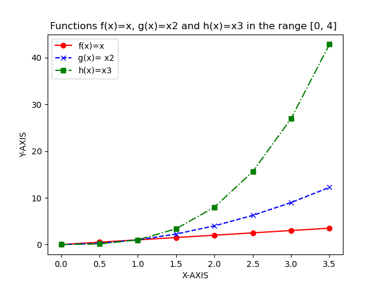

## Weekly Task 02 bmy.py

### Task Description:
Write a program that calculates somebody's body mass index (BMI)

### Explaining:
This program calculates a person's Body Mass Index. The user will first be asked to enter their weight in kilograms, after they have to insert their height in centmetres. We use the Float method to convert string to float. The formula to calculate the BMI is BMI = kg/m2 . Than the output is printed. 

### Reference:
https://www.diabetes.ca/managing-my-diabetes/tools---resources/body-mass-index-(bmi)-calculato

https://stackoverflow.com/questions/20405610/bmi-calculator-in-python/20405792

https://www.w3schools.com/python/ref_func_float.asp
___

## Weekly Task 03 secondstring.py

### Task Description:
Write a program that asks a user to input a string and outputs every second letter in reverse order.

### Explaining:
First we ask the user to input a sentence to creat a string, each character in a string has a corresponding numerical value. To reverse a string in python we have to use a slice function. In order to move two steps backward we used the slice statement [::-2] that shows the full string every second value backwards and prints out these characters. The start and end point are left blank to include the entire string.

### Reference:
https://www.educative.io/courses/learn-python-3-from-scratch/mE73nLqKGA3

https://www.w3schools.com/python/python_strings_slicing.asp

https://railsware.com/blog/python-for-machine-learning-indexing-and-slicing-for-lists-tuples-strings-and-other-sequential-types/#Slice_Notation
___

## Weekly Task 04 collatz.py

### Task Description:
 Write a program that asks the user to input any positive integer and outputs the successive values of the following calculation. At each step calculate the next value by taking the current value and, if it is even, divide it by two, but if it is odd, multiply it by three and add one.

### Explaining: 
 The user is asked to input a positive integer. Then a list [] is used to store multiple items in a single variable. The script uses a while statement, that execute the code as long as the while statement's condition is true, to check if the number is not 1.  The if statement will run as long as the statement is true, if the number is even (%2==0) the number is diveded by 2 than the output will be added to the list (mylist.append(number)) and will be used as the input for the next run of the code. If the statement is not true the else statement will take the number and multiple by 3 and add 1 than the output will be added to the list. This is repeated until the output is equal to 1.

### Reference:
https://www.w3schools.com/python/python_lists.asp

https://www.w3schools.com/python/ref_list_append.asp

https://www.w3schools.com/python/python_conditions.asp

https://www.w3schools.com/python/python_while_loops.asp
___

## Weekly Task 05 weekday.py

### Task Description:
Write a program that outputs whether or not today ia a weekday

### Explaining:
To start we import a module named datetime to work with dates. The function datetime.now() turns a datetime object of today. Then we use strftime method for formatiing date objects into readable string.This is set as an integer an passed to the if, elif and else statement. If today is saturday, else if its sunday it will print "It is the weekend, yay!", otherwise it will print "Yes, unfortunately today is a weekday". 

### Reference:
https://www.w3schools.com/python/python_datetime.asp

https://www.w3schools.com/python/gloss_python_elif.asp

https://www.dataquest.io/blog/python-datetime-tutorial/
___

## Weekly Task 06 squareroot.py

### Task Description:
Write a program that takes a positive floating-point number as input and outputs and outputs an approximation of its square root.
___

## Weekly Task 07 es.py
 
### Task Description:
Write a program that reads in a text file and outputs the number of e's it contains.

### Explaining:
 First We have to import the module sys in order to read the file as an argument. Then we use the list sys.argv[1] which contains the command-line arguments passed to the script, in order for mobydick.txt to be read in it had to be written on the terminal command once i called the function. After we use def function that counts the number of times the letter "e" appears, we defined this function with two variables, filename and letter.The filename is opened as f and the content is stored in a variable that check that the file will read in correctly, then it reads the whole file and count the chosen letter. Finally we call the function and display the letter count.

### Reference: 
https://www.geeksforgeeks.org/count-the-number-of-times-a-letter-appears-in-a-text-file-in-python/

https://www.pythonforbeginners.com/system/python-sys-argv

https://www.w3schools.com/python/ref_string_count.asp

https://www.w3schools.com/python/python_functions.asp

https://www.gutenberg.org/files/2701/2701-h/2701-h.htm

___

## Weekly Task 08 plottask.py

### Task Description:
Write a program called plottask.py that displays a plot of the functions f(x)=x, g(x)=x2 and h(x)=x3 in the range [0, 4] on the one set of axes.

### Explaning:
First we have to import Numpy(used to work with arrays) and Matlibplot(used for visualizing the data on plots). To return spaced values within a given interval we used np.range to define the range for the x-axis. The y-axis will be defined by the function that were defined here:  f(x)=x, g(x)=x2 and h(x)=x3(plotted separately but on the same axis). Next plt.plt is used to format the functions that we want to show on the graph, within the brackets we defined the colour, the line marker type for the line and the label for the line.We then add the plot label, title and legend, wich displays labels. Finally we use the code plt.show() to show the graphic representation and how the plot looks like when we run the program.

### Reference: 
https://www.w3schools.com/python/matplotlib_markers.asp

https://numpy.org/doc/stable/reference/generated/numpy.arange.html

https://realpython.com/how-to-use-numpy-arange/

https://www.activestate.com/resources/quick-reads/how-to-display-a-plot-in-python/

